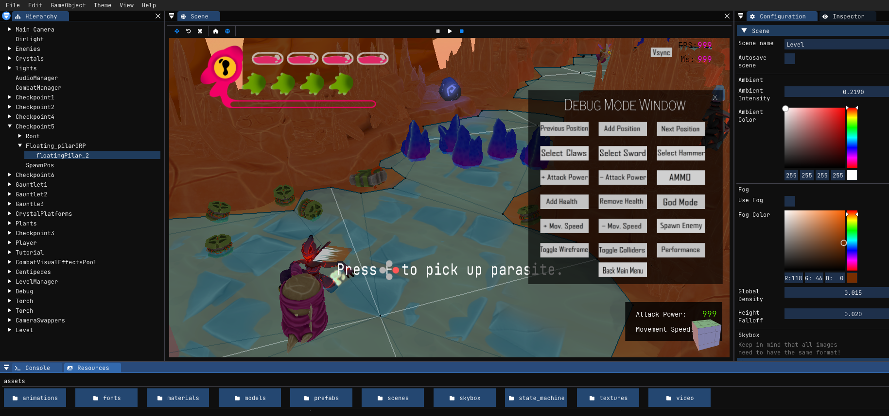
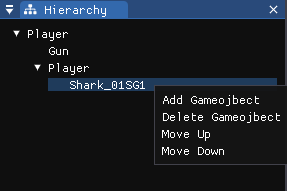

<h1 align="center">
  <a href="https://github.com/AkitaInteractive/Hachiko-Engine">Hachiko Engine 🐕</a>
</h1>

<p align="center">
<a href="https://github.com/abhisheknaiidu/awesome-github-profile-readme/stargazers"></a>
<a href="https://github.com/abhisheknaiidu/awesome-github-profile-readme/network/members"></a>
<a href="https://github.com/abhisheknaiidu/awesome-github-profile-readme/pulls"></a>
<a href="https://github.com/abhisheknaiidu/awesome-github-profile-readme/issues"></a>
<a href="https://github.com/abhisheknaiidu/awesome-github-profile-readme/graphs/contributors"></a>
<a href="https://github.com/abhisheknaiidu/awesome-github-profile-readme/blob/master/LICENSE"></a>
</p>

Hachiko is a custom built C++ Game Engine developed by Akita Interactive.



**Large Files (Place In Assets/Models/Large)** https://drive.google.com/drive/folders/1Byno0EpZmpJipA2klS0w_CSnN3oMzuFw?usp=sharing

## The Team ✨
### Programmers💻
* **Alvaro Soppelsa** - [alvarosoppelsa](https://github.com/alvarosoppelsa)
* **Armando González** - [armandojaga](https://github.com/armandojaga)
* **Baran Sürücü** - [baransrc](https://github.com/baransrc)
* **Bernat Güell** - [bernatgb](https://github.com/bernatgb)
* **Bernat Martínez** - [Bernatmago](https://github.com/Bernatmago)
* **Edward Regas** - [EdwardRegasDuncan](https://github.com/EdwardRegasDuncan)
* **Eric Torres** - [Erick9Thor](https://github.com/Erick9Thor)
* **Joel Herraiz** - [Izenz](https://github.com/Izenz)
* **Marius Dambean** - [ermario](https://github.com/ermario)
* **Miquel Miró** - [miquelmiro3](https://github.com/miquelmiro3)
* **Mónica Martín** - [monikamnc](https://github.com/monikamnc)
* **Vicenç Bosch** - [VBoschMatas](https://github.com/VBoschMatas)

### Artists 🎨
* **Clàudia Escuder** - [Linkedin](https://www.linkedin.com/in/claudia-escuder-b78b661bb)
* **Claudia Martín** - [Linkedin](https://www.linkedin.com/in/claudia-martin-5848721b7)
* **Eduard Gállego** - [Linkedin](https://www.linkedin.com/in/eduardgallegorodriguez)
* **Eduardo Godoy** - [Linkedin](https://www.linkedin.com/in/eduardo-godoy-saavedra)
* **Ehsan Zareh** - [Linkedin](https://www.linkedin.com/in/ehsan-zareh-6497831b7)
* **Isabel Lammens** - [Linkedin](https://www.linkedin.com/in/isabel-lammens-516bba1bb)
* **Phan Minh Hieu** - [Linkedin](https://www.linkedin.com/in/hnguyen7596)

### Sound 🔊
* **Marcio Echevarría** - [Linkedin](https://www.linkedin.com/in/marcio-echeverria-39b08241)

## Main Features 🧪
Brief summary of the engine main functionalities
- Unity like camera controls
- Scene serialization (loading & saving)
- Scene creation with gameobjects & components.
- Scene edition via hierarchy, guizmos, inspector & configuration
- Unity like play stop pause controls, scene returns to its original state on stop
- Asset management system
- Navigation system
- Advanced render pipeline:
    - Mesh & texture batching
    - Deferred rendering
    - PBR Lighting with skybox IBL
    - Exponential height Fog
    - Ambient occlusion
    - Particle & billboards with instance rendering
    - Unity like materials
    - Video Rendering
    - UI Rendering with text
- C++ based scripting system with hot reload

### Components 🔬
Blocks used to extend all gameobjects and build all the game features.

- Transform
- Mesh Renderer (Mesh + Material)
- Camera
- Lights (Direcional, Point, Spot)
- UI (Canvas, Renderer, Transform 2D, Image, Text, Button, Progress Bar)
- Script
- Navigation (Agent, Obstacle)
- Audio (Listener, Source)
- Billboard
- Particle System
- Video

## Built with 🛠️

* [OpenGL](https://www.opengl.org//) - A cross-language, cross-platform application programming interface (API) for rendering 2D and 3D vector graphics.
* [SDL](https://www.libsdl.org/) - Simple DirectMedia Layer to interact with hardware via OpenGL.
* [DevIL](http://openil.sourceforge.net/about.php) - A programmer's library to develop applications with very powerful image loading capabilities.
* [Assimp](https://www.assimp.org/) - portable Open-Source library to import various well-known 3D model formats in a uniform manner.
* [ImGui](https://github.com/ocornut/imgui) - A bloat-free graphical user interface library for C++.
* [MathGeoLib](https://github.com/juj/MathGeoLib) - A library for linear algebra and geometry manipulation for computer graphics.
* [PhysicsFS](https://github.com/icculus/physfs) - A portable, flexible file i/o abstraction.
* [ImGuizmo](https://github.com/CedricGuillemet/ImGuizmo) - Colletion of useful ImGui widgets.
* [ImGuiFileDialog](https://github.com/aiekick/ImGuiFileDialog) - File selection dialog built in ImGui.
* [YamlCpp](https://github.com/jbeder/yaml-cpp) - A fast YAML parser/generator for C++.
* [Recast & Detour](https://github.com/recastnavigation/recastnavigation) - State of the art navigation mesh construction toolset for games and path-fiding toolkit.
* [Freetype](https://gitlab.freedesktop.org/freetype/freetype) - Library to load & render fonts.
* [GLFont](https://github.com/jtberglund/GLFont) - GLFont is a text-rendering library written in C++ for OpenGL, using FreeType.
* [Libav](https://github.com/libav/libav) - Collection of libraries and tools to process multimedia content such as audio, video, subtitles and related metadata.
* [Xxhash](https://github.com/Cyan4973/xxHash) - Extremely fast Hash algorithm.
* [Optik Profiler](https://github.com/bombomby/optick) - A super-lightweight C++ profiler for Games.
* [Wwise](https://www.audiokinetic.com) - Greatest Sound Engine feature-rich for interactive audio.

## License 📄
This project is under the MIT License [LICENSE](LICENSE).

# First steps 📚

## Using a scene 🌄
To start seeing a model you can drop any file from ```Game/Assets/Models``` into the screen. Alternatively you can load a scene going to ``` File -> Load -> Scene ``` and choosing the ```.scene``` file you want to use.


## Navigation 🚀
Scene navigation controls resemble the ones from unity:
* Move the camera as fps game using right click + W, A, S, D
* Orbit the model using Alt + mouse motion
* Pres F to focus on model

## Game Objects & Components 🗿
The engine is based arround hierarchies of game objects that have a set of components asociated to them. All game objects will have at least a transform.

You can edit the game objects distribution via the **scene hierarchy** by dragging them or using the contextual menu that pops up with right click. You can also select objects by clicking them on the scene (As long as they have a mesh).



To tweak components or create them you can select the desired game object and go to the **inspector**, Each compoentn has its own set of options.


Alternatively you can modify the transform using the **guizmo**, to change its current mode use the buttons at top left of the scene or the W, E, R keys.


# Project Érimos 🛸🏜️💎
Game built while developing Hachiko Engine.

## Narrative 📜
Stranded on a mysterious planet during a reconnaissance mission gone astray, the Captain of Space Fleet AKT must find a way to fight through an infected horde of creatures to defeat their leader and return home. Ancient ruins, hellish canyons, and vicious parasites lie waiting for our lone survivor. 

## Gameplay 🎮
Érimos Project is a fast paced hack-and-slash that allows players to use the corpses of fallen enemies to enhance their character’s body. Discover the possibilities of your ever-shifting arsenal by acquiring parasites from your foes, allowing for engaging replayability. Dash across retracting platforms, navigate past lasers, evade enemy attacks, and slice your way to freedom in two distinct levels that culminate in an epic boss encounter. 


