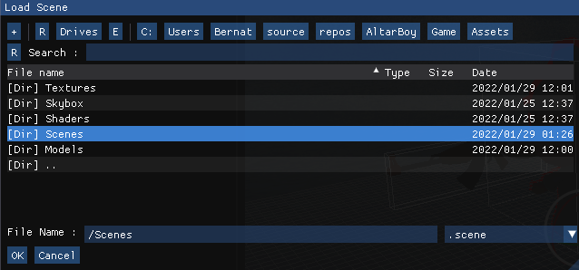

**VS3 Level FBX, add next to meta** https://drive.google.com/file/d/1Ok9IfFrLxllcwURzFzY4l3iuEpFNGX4g/view?usp=sharing

# Hachiko Engine 🐕
Hachiko is a custom built C++ Game Engine developed by Akita Interactive.


## Team 💻
* **Alvaro** - [alvarosoppelsa](https://github.com/alvarosoppelsa)
* **Armando** - [armandojaga](https://github.com/armandojaga)
* **Baran** - [baransrc](https://github.com/baransrc)
* **Bernat G** - [bernatgb](https://github.com/bernatgb)
* **Bernat M** - [Bernatmago](https://github.com/Bernatmago)
* **Edward** - [EdwardRegasDuncan](https://github.com/EdwardRegasDuncan)
* **Eric** - [Erick9Thor](https://github.com/Erick9Thor)
* **Joel** - [Izenz](https://github.com/Izenz)
* **Kike** - [OGKoko](https://github.com/OGKoko)
* **Marius** - [ermario](https://github.com/ermario)
* **Miquel** - [miquelmiro3](https://github.com/miquelmiro3)
* **Mónica** - [monikamnc](https://github.com/monikamnc)
* **Vicenç** - [VBoschMatas](https://github.com/VBoschMatas)

## How to use 🔧

### Using a scene
To start seeing a model you can drop any file from ```Game/Assets/Models``` into the screen. Alternatively you can load a scene going to ``` File -> Load -> Scene ``` and choosing the ```.scene``` file you want to use.




### Navigation
Scene navigation controls resemble the ones from unity:
* Move the camera as fps game using right click + W, A, S, D
* Orbit the model using Alt + mouse motion
* Pres F to focus on model

### Game Objects & Components
The engine is based arround hierarchies of game objects that have a set of components asociated to them. All game objects will have at least a transform.

You can edit the game objects distribution via the **scene hierarchy** by dragging them or using the contextual menu that pops up with right click. You can also select objects by clicking them on the scene (As long as they have a mesh).


To tweak components or create them you can select the desired game object and go to the **inspector**, Each compoentn has its own set of options.


Alternatively you can modify the transform using the **guizmo**, to change its current mode use the buttons at top left of the scene or the W, E, R keys.


## Features
Based on the second assignment requirements
- Unity like camera controls
- Previous menus (Altar Boy + UPC-Engine) and new ones for the new features
- Engine loads with survival shooter scene
- Scene serialization (loading & saving)
- Quadtree frustum culling
- Editable scene with guizmos
- Editable materials that support diffuse and specular maps
- PBR Phong shader with support for a directional light and multiple point & spot lights
- Unity like play stop pause controls, scene returns to its original state on stop

### Extra features
- Raycast selection
- Stencil of the selected object
- Scene configuration
    - Ambient light
    - Toggleable skybox & background color
    - Toggleable Debug Draw & gui information
        - Transform & Camera debug information
        - Quadtree debug draw
        - Bounding boxes drawing
        - Light components debug draw (Needs to be tunned)
- Configurable Components
    - Lights parameters
    - Materials properties
    - Camera configuration
        - Any camera can be set as culling camera
- Timers window


## Built with 🛠️

* [OpenGL](https://www.opengl.org//) - A cross-language, cross-platform application programming interface (API) for rendering 2D and 3D vector graphics.
* [SDL](https://www.libsdl.org/) - Simple DirectMedia Layer to interact with hardware via OpenGL.
* [DevIL](http://openil.sourceforge.net/about.php) - A programmer's library to develop applications with very powerful image loading capabilities.
* [Assimp](https://www.assimp.org/) - portable Open-Source library to import various well-known 3D model formats in a uniform manner.
* [ImGui](https://github.com/ocornut/imgui) - A bloat-free graphical user interface library for C++.
* [MathGeoLib](https://github.com/juj/MathGeoLib) - A library for linear algebra and geometry manipulation for computer graphics.
* [PhysicsFS](https://github.com/icculus/physfs) - A portable, flexible file i/o abstraction.
* [ImGuizmo](https://github.com/CedricGuillemet/ImGuizmo) - Colletion of useful ImGui widgets.
* [ImGuiFileDialog](https://github.com/aiekick/ImGuiFileDialog) - File selection dialog built in ImGui.
* [RapidJSON](https://github.com/Tencent/rapidjson/) - A fast JSON parser/generator for C++.
* [Optik Profiler](https://github.com/bombomby/optick) - A super-lightweight C++ profiler for Games.

## License 📄
This project is under the MIT License [LICENSE](LICENSE).
